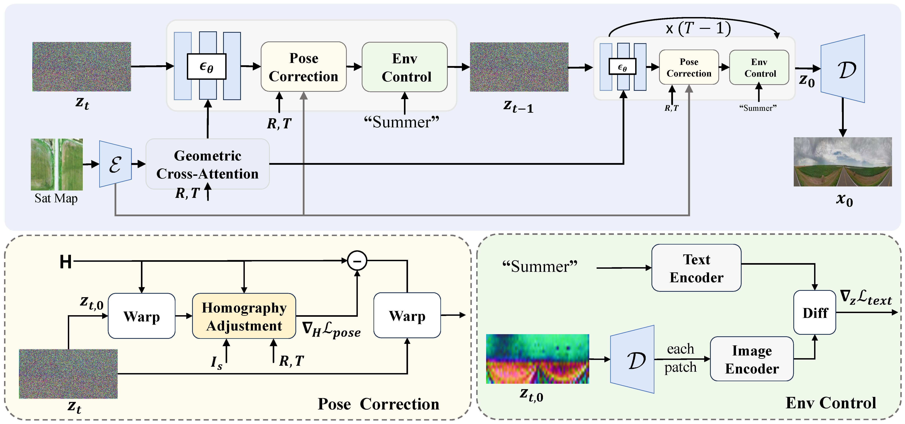

<h1 align="center">Controllable Satellite-to-Street-View Synthesis with Precise Pose Alignment and Zero-Shot Environmental Control (ICLR 2025)</h1>

<p align="center">
    <!-- <a href="https://arxiv.org/abs/2310.05077">
    </a> -->
    <a href="https://arxiv.org/pdf/2502.03498"></a>
    <a href="https://github.com/zexianghui/CS2S_pose_environment">
    </a>
    <a href="https://github.com/zexianghui/CS2S_pose_environment/blob/main/LICENSE"></a>
</p>

> [Xianghui Ze](https://github.com/zexianghui), [Zhenbo Song](https://github.com/ZhenboSong), Qiwei Wang, [Jianfeng Lu](https://dblp.org/pid/82/6187-3.html), [Yujiao Shi](https://github.com/YujiaoShi)
> 
> **Abstract**: Generating street-view images from satellite imagery is a challenging task, particularly in maintaining accurate pose alignment and incorporating diverse environmental conditions. While diffusion models have shown promise in generative tasks, their ability to maintain strict pose alignment throughout the diffusion process is limited. In this paper, we propose a novel Iterative Homography Adjustment (IHA) scheme applied during the denoising process, which effectively addresses pose misalignment and ensures spatial consistency in the generated street-view images. Additionally, currently, available datasets for satellite-to-street-view generation are limited in their diversity of illumination and weather conditions, thereby restricting the generalizability of the generated outputs. To mitigate this, we introduce a text-guided illumination and weather-controlled sampling strategy that enables fine-grained control over the environmental factors. Extensive quantitative and qualitative evaluations demonstrate that our approach significantly improves pose accuracy and enhances the diversity and realism of generated street-view images, setting a new benchmark for satellite-to-street-view generation tasks.



<p align="center"> &#x1F31F; If ControlS2S is helpful to your projects, please help star this repo. Thanks!</p>

# The Table of Contents
- [:clap: How to run](#clap-how-to-run)
  - [:one: Dependencies and installation](#one-dependencies-and-installation)
  - [:two: Prepare Dataset](#two-prepare-dataset)
  - [:three: Checkpoints Downloading](#three-checkpoints-downloading)
  - [:four: Test and visualization](#four-test-and-visualization)
  - [:five: Train](#five-train)
  - [:six: Evaluate](#six-evaluate)
- [:fire: Citation](#fire-citation)
- [:sparkles: Acknowledgement](#sparkles-acknowledgement)
- [:heart: Contact](#heart-contact)

## :one: Dependencies and installation
```bash
# install
conda create -n ControlS2S python=3.8
conda activate ControlS2S
conda install pytorch==1.13.1 torchvision==0.14.1 torchaudio==0.13.1 pytorch-cuda=11.7 -c pytorch -c nvidia
pip install pytorch-lightning==1.9.5
pip install omegaconf einops  matplotlib opencv-python==4.9.0.80 scikit-image==0.21.0 kornia prefetch_generator lpips pytorch-msssim
pip -e git+https://github.com/CompVis/taming-transformers.git@master#egg=taming-transformers
pip -e git+https://github.com/openai/CLIP.git@main#egg=clip
# ckpt
mkdir ckpt && cd ckpt
curl -L https://huggingface.co/CompVis/stable-diffusion-v-1-4-original/resolve/main/sd-v1-4.ckpt  -o sd-v1-4.ckpt
```


## :two: Prepare Dataset
```bash
dataset
|-- CVUSA
|-- VIGOR
|-- KITTI_location

CVUSA dataset from https://github.com/qianmingduowan/Sat2Density
VIGOR dataset from https://github.com/Jeff-Zilence/VIGOR & https://github.com/tudelft-iv/SliceMatch
KITTI_location dataset from https://github.com/YujiaoShi/HighlyAccurate
```
## :three: Checkpoints Downloading
Checkpoints can be found from [this url](http://pan.njust.edu.cn/#/link/zgGzHgpgIuoBBFGIv22v).

## :four: Test and visualization
```bash
# VIGOR
python visualization.py --base configs/Boost_Sat2Den/VIGOR_geo_ldm.yaml --devices 0, --strategy ddp --test result/VIGOR_ckpt/checkpoints/VIGOR.ckpt --function 1
# CVUSA
python visualization.py --base configs/Boost_Sat2Den/CVUSA_geo_ldm.yaml --devices 0, --strategy ddp --test result/CVUSA_ckpt/checkpoints/CVUSA.ckpt --function 1
# KITTI
python visualization.py --base configs/Boost_Sat2Den/KITTI_geo_ldm.yaml --devices 0, --strategy ddp --test result/KITTI_ckpt/checkpoints/KITTI.ckpt --function 1
``` 

# :five: Train
```bash
# KITTI
python main.py --base configs/Boost_Sat2Den/train/KITTI_geo_ldm.yaml --devices 0, --strategy ddp 
# CVUSA
python main.py --base configs/Boost_Sat2Den/train/CVUSA_geo_ldm.yaml --devices 0, --strategy ddp
# VIGOR
python main.py --base configs/Boost_Sat2Den/train/VIGOR_geo_ldm.yaml --devices 0, --strategy ddp
```

# :six: Evaluate

# :fire: Citation
If our work is useful for your research, please consider citing:

```
@article{ze2025controllable,
  title={Controllable Satellite-to-Street-View Synthesis with Precise Pose Alignment and Zero-Shot Environmental Control},
  author={Ze, Xianghui and Song, Zhenbo and Wang, Qiwei and Lu, Jianfeng and Shi, Yujiao},
  journal={arXiv preprint arXiv:2502.03498},
  year={2025}
}
```

# :sparkles: Acknowledgement

- This project is based on [Stable Diffusion](https://github.com/CompVis/stable-diffusion)

- This Readme is inspired by [CodeFormer](https://github.com/sczhou/CodeFormer) and [RobustSIRR](https://github.com/ZhenboSong/RobustSIRR)

- For More Awesome Sat2Grd methods, you can refer to :+1: [Sat2Den](https://github.com/qianmingduowan/Sat2Density), [Sat2Str](https://github.com/YujiaoShi/Sat2StrPanoramaSynthesis)

# :heart: Contact

If you have any questions, please feel free to reach out at [`zexh@njust.edu.cn`](mailto:zexh@njust.edu.cn).